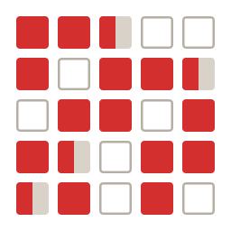
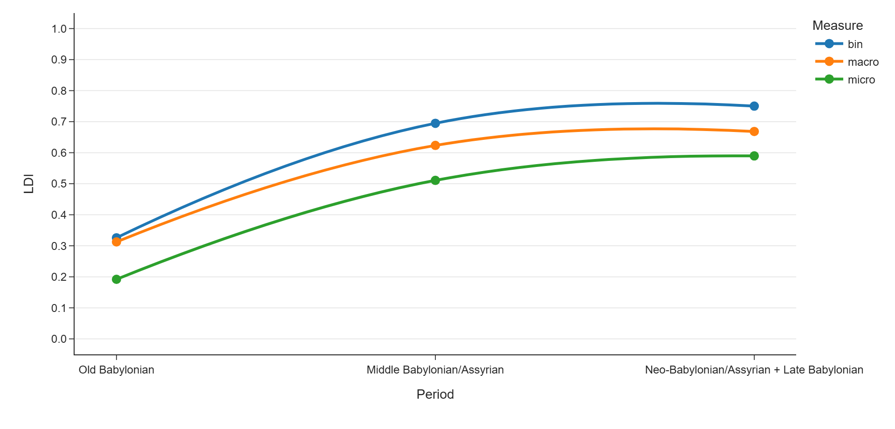

# Logograms Analyser

A tool and corpus for measuring the **Logogram Density Index (LDI)** across a
diachronic corpus of Mesopotamian omen texts: the "logographic shift", the
increasing use of Sumerian logograms in cuneiform divination from the Old
Babylonian period into the first millennium BCE.

<!-- TODO: add once the Zenodo DOI is minted:
[](https://doi.org/10.5281/zenodo.XXXXXXX)
-->
[](LICENSE)
[](data/LICENSE)

This repository accompanies the article *The Logographic Shift: Tracking the
"Sumerianizing" Process in Cuneiform Divination* (Luis Sáenz, forthcoming).



Across **6,978 omens in 196 texts**, the index rises from 0.33 in the Old
Babylonian period to 0.69 in the Middle period and 0.75 in the first
millennium: writing that begins as syllabic Akkadian ends up almost entirely
logographic, without the language itself changing.

## The index

The **LDI** is the share of logographic writing in an omen, from 0 (fully
syllabic) to 1 (fully logographic). It measures the *written surface*, not the
language beneath it: two tablets transmitting the same Akkadian words can score
very differently.

Because a single word can mix logographic and syllabic signs (`DU-ak`, one
logogram plus one phonetic complement), the index is reported in three forms:

```
bin    = logographic words / words           # by word, all-or-nothing
macro  = mean of each word's logogram share  # by word, graded
micro  = logographic signs / signs           # by sign
```

- **bin** — a word counts as logographic (1) or not (0). `DU-ak` counts as 1.
- **macro** — averages each word's own logographic fraction, so `DU-ak` counts
  as 0.50 (one logographic sign of two).
- **micro** — weighs by sign, dividing logographic signs by all signs.

`bin` is never lower than `macro`. Beyond that the three are **not ordered**:
`micro` weighs each word by its length, so whether it lands above or below
`macro` depends on whether a text's longer words are its more or its less
logographic ones. They diverge both over mixed words and over multi-sign
logograms, since a compound such as `E₂.KUR.MEŠ` counts once in `bin` but three
times in `micro`.

### Counting conventions

Any such index rests on counting decisions, and the figures move with them. The
canonical convention here is: **determinatives excluded** from numerator and
denominator; **Sumerian (`%sux`) held out**, since the index measures how
Akkadian is written; the **omen-opening particle** (DIŠ, BE, BAD, UD, AŠ)
**counted** as the logogram it is; the one-sign prepositions ***ina*/*ana*
counted as syllabic**; the editor's **restorations counted**; and the
number-logograms 15 (ZAG), 150 (GUB₃) and 30 (Sîn) counted as logograms.
Paratext is excluded before counting: the contents of eBL-ATF discourse
sections (`@colophon`, `@catchline`, …) and `!cm`/`!qt`/`!zz` commentary spans.

None of these is the only defensible choice, so the app never hides them behind
a switch: **every report table prints the alternatives as columns** beside the
baseline (*ina*/*ana* as logographic, restorations dropped, particle excluded),
together with the word composition the three measures summarise
(pure-logographic / mixed / syllabic). Corpus-wide the conventions span
0.465–0.736, which is why a bare figure is not portable between studies.

The segmentation rules are documented in full in
[`data/corpus-counting.md`](data/corpus-counting.md).

## The corpus

`data/` holds the transliteration corpus, organised by period and by divination
discipline:

```
data/
  old/          Old Babylonian ................... 761 omens (29 texts)
  middle/       Middle Babylonian / Assyrian .... 2,325 omens (88 texts)
  new/          First-millennium (NA / NB / LB) . 3,892 omens (79 texts)
      └── astrology/ diagnostic/ extispicy/ izbu/ terrestrial/
  _comparanda/  held out: Hittite and Hurrian recensions, lung and liver
                models, an incantation and a prayer for cross-genre contrast
  kal5/         supplementary Aššur extispicy witnesses (Heeßel 2012 KAL 5),
                documented but kept out of the counts
```

Each text carries YAML frontmatter (period, provenance, discipline, edition,
counting mode). Folder depth supplies topic and feature, so
`extispicy/liver/martu/` is scored as its own topic-controlled arc.

[`data/corpus-manifest.md`](data/corpus-manifest.md) lists every text with its
omen count; the primary editions behind the transliterations are recorded in
[`references.bib`](references.bib).

## Using it

**In the browser** — a WebAssembly build (stlite) runs the whole app and corpus
client-side, with no server, published to GitHub Pages by
[`deploy-pages.yml`](.github/workflows/deploy-pages.yml).

**As a desktop app** — an Electron package that needs no Python installation:

```bash
cd desktop
npm install
npm run build      # stage the app + corpus, dump the stlite artifacts
npm run app:dist   # installer in desktop/dist/
```

**Locally** — requires Python 3.11+ (v1.0.0 was built and tested on 3.12; the
dependency versions it was released against are pinned in `requirements.txt`):

```bash
pip install -r requirements.txt
streamlit run app.py       # then open http://localhost:8501
```

> On Windows, where `python` may resolve to an msys2 build without pip, use the
> launcher: `py -m streamlit run app.py`.

The app has four tabs: **LDI** (five views: overview, discipline, region,
topics, and a per-text browser with sign-by-sign colour coding), **Sources** (a
catalogue of every manuscript with its metadata, LDI and eBL link),
**Bibliography**, and **Editor** (measure a pasted line, edit a text, import
your own).

### Analysing your own texts

Upload in the Editor takes one file, several at once, a `.zip`, or a folder on
your machine, read recursively. Imported texts are filed by their own
frontmatter into `data/_custom/`, which is kept **separate from the published
corpus**: the figures the article reports never move because you added
something. A scope switch above the LDI views then chooses what is scored —
the published corpus, your texts, or both — and every view works on the
selection, not just the text browser.

A text needs a `period:` line to be placed on the diachronic axis. Without one
it is filed under `unspecified/`, opens in the editor on import, and is named in
a banner on the LDI page; its omens are pooled into the totals but sit in an
*Undated* row rather than being silently dated. Periods are folded into the
three broad buckets, and the post-Achaemenid labels (Achaemenid, Seleucid,
Parthian, …) fold into the Neo/Late Babylonian one.

> **Where your texts live.** In the local and desktop builds imports are written
> to disk and are there next time you open the app; "Discard my corpus" in the
> Upload dialog deletes them. In the **browser build there is no disk**: the page
> runs in a WebAssembly sandbox, so imports last for the session and are gone on
> reload. Nothing is ever uploaded anywhere — GitHub Pages only serves the page,
> it cannot receive anything, so your texts never leave your machine.

## Reproducing the published figures

Everything in the article is regenerable from the corpus:

```bash
py -3 scripts/corpus_manifest.py    # per-text omen counts (data/corpus-manifest.md)
py -3 reproduce_tables.py           # every table of figures reported in the article
py -3 scripts/make_figures.py       # all 18 charts into assets/
py -3 scripts/restoration_sweep.py  # the restoration sensitivity sweep
```

`compute_ratios.py` is the Streamlit-free analysis library behind them, and
mirrors the app's scoring exactly, so a batch run and the app never disagree.

## Contributing to the corpus

`data/corpus-manifest.md` and `data/corpus_manifest.csv` are committed so the
published tables can be checked against them, which means they must never
disagree with the corpus they ship beside. Enable the hook that keeps them in
step, once per clone:

```bash
git config core.hooksPath .githooks
```

It regenerates both files whenever a commit touches `data/`, and refuses the
commit if corpus files have unstaged edits, since the manifest would otherwise
describe a state the commit does not contain.

One trap when adding texts: in YAML frontmatter, quote any value containing a
colon followed by a space, or the whole header fails to parse and the text
silently loses its metadata.

## Licensing

- **Software** (`app.py`, `compute_ratios.py`, `scripts/`, …):
  [MIT License](LICENSE).
- **Data** (the `data/` corpus and derived tables): [CC BY 4.0](data/LICENSE).

Individual omen transliterations are based on published cuneiform text editions;
users remain responsible for citing the underlying primary editions (see
[`references.bib`](references.bib)).

## Citation

See [`CITATION.cff`](CITATION.cff), or use GitHub's *Cite this repository*
button. Once archived on Zenodo, please cite the concept DOI.
